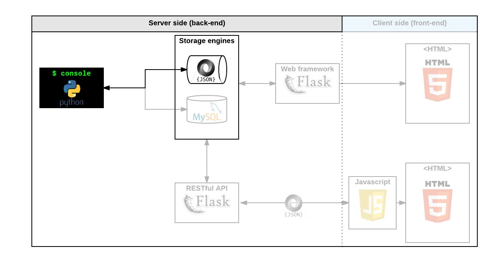

<div align="center">
<h3>AirBnB clone - The console</h3>
<h3>A command interpreter to manipulate data without a visual interface</h3>
<h5>Python OOP</h4>
  
</div>

### **Welcome to the AirBnB clone project!**
Before starting, please read the AirBnB concept page.

***First step: Write a command interpreter to manage your AirBnB objects.***
This is the first step towards building your first full web application: the AirBnB clone. This first step is very important because you will use what you build during this project with all other following projects: HTML/CSS templating, database storage, API, front-end integration…

Each task is linked and will help to:

- put in place a parent class (called `BaseModel`) to take care of the initialization, serialization and deserialization of future instances
- create a simple flow of serialization/deserialization: Instance <-> Dictionary <-> JSON string <-> file
- create all classes used for AirBnB (`User`, `State`, `City`, `Place`…) that inherit from `BaseModel`
- create the first abstracted storage engine of the project: File storage.
- create all unittests to validate all our classes and storage engine
## **The console**
- create your data model
- manage (create, update, destroy, etc) objects via a console / command interpreter
- store and persist objects to a file (JSON file)
The first piece is to manipulate a powerful storage system. This storage engine will give us an abstraction between “My object” and “How they are stored and persisted”. This means: from the console code (the command interpreter itself) and from the front-end and RestAPI to build later, there won’t be a need to pay attention (take care) of how the objects are stored.

This abstraction will also allow you to change the type of storage easily without updating all of your codebase.

The console will be a tool to validate this storage engine

Execution
Your shell should work like this in interactive mode:
```
$ ./console.py
(hbnb) help

Documented commands (type help <topic>):
========================================
EOF  help  quit

(hbnb) 
(hbnb) 
(hbnb) quit
$
```
But also in non-interactive mode
```
$ echo "help" | ./console.py
(hbnb)

Documented commands (type help <topic>):
========================================
EOF  help  quit
(hbnb) 
$
$ cat test_help
help
$
$ cat test_help | ./console.py
(hbnb)

Documented commands (type help <topic>):
========================================
EOF  help  quit
(hbnb) 
$
```


##### Authors: **`Adam Sanusi Babatunde`** & **`Linda Nwachukwu`**
